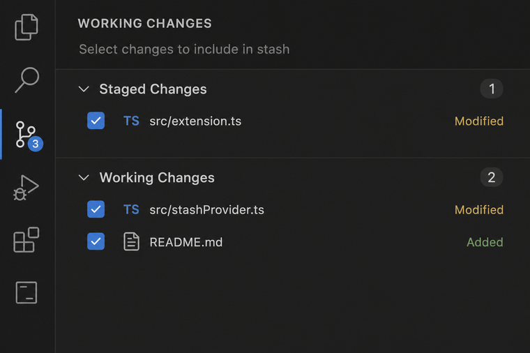
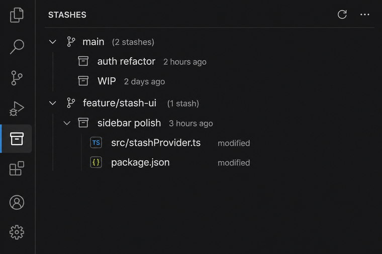

# Stasher

Stasher is a Visual Studio Code extension for managing Git stashes from the Activity Bar without dropping to the terminal. It gives you a visual workflow for creating, browsing, updating, comparing, and restoring stashes directly inside VS Code.

## Getting started

1. Install **Stasher** from the VS Code Marketplace (or load the `.vsix`).
2. Open a workspace folder that contains a **Git repository**.
3. Click the **Stasher** icon in the **Activity Bar** (left sidebar — archive/box icon).
4. Use **Working Changes** to stash all or selected files; use **Stashes** to browse and restore saved work.

## Screenshots

### Working Changes — check files, then stash

Use the checkboxes to pick which files go into the next stash. Toolbar actions include **Stash All**, **Stash Checked**, **Quick Stash**, **Stash Staged**, and **Stash Working** (keep index).



### Stashes — browse, filter, and restore

Stashes show `stash@{n}`, age, file count, and optional notes. Enable **Group by Branch** or **Group Files by Directory** from the toolbar. Right-click a stash to apply, pop, diff, pin, or export.



## Features

- Create named or unnamed stashes from the sidebar
- **Stash staged only** or **stash working tree** (keep index)
- Partially stash selected files from your working tree (checkbox selection)
- Browse existing stashes with file counts, notes, and branch grouping
- Apply, pop, rename, or delete stashes — with **conflict preview** when files overlap
- **Review stale stashes** (bulk delete, export, or pin)
- Create a branch from a stash
- Compare stashes, view per-file diffs, and apply selected hunks
- Export/import `.patch` files, search inside stashes, timeline view

## Views

Stasher adds an Activity Bar container with two views:

- **Working Changes**: staged and working-tree files with checkbox-based partial stashing
- **Stashes**: all stashes with optional branch/directory grouping

## Requirements

- VS Code `1.85.0` or newer
- Git available on your system
- A workspace folder opened in VS Code that is backed by Git

## Common Actions

| Category | Command |
|----------|---------|
| Create | Create Stash, Quick Stash, Partial Stash, Stash Staged, Stash Working |
| Restore | Apply Stash, Pop Stash, Unstash Files, Apply Hunks |
| Browse | Filter Stashes (live), Search Inside Stashes, Open Timeline |
| Safety | Review Stale Stashes, conflict preview on apply/pop |
| Manage | Pin, Notes, Labels, Merge/Compare, Export/Import patches |

Most actions are in the view toolbar or item context menus. Use the **Command Palette** (`Stasher:`) for full discoverability.

## Settings

Key settings under **Stasher**:

- `stasher.groupByBranch` / `stasher.groupFilesByDirectory` / `stasher.groupWorkingByDirectory`
- `stasher.staleThresholdDays` — when stashes are considered stale (default 7)
- `stasher.showFileCountsInTree` / `stasher.showNotesInTree`

## Development

```bash
npm install
npm run build
npm test
```

Press **F5** to launch the Extension Development Host. Regenerate README images with:

```bash
python3 scripts/generate-readme-screenshots.py
```

See [scripts/capture-screenshots.md](scripts/capture-screenshots.md) for capturing real VS Code screenshots from F5.

## License

MIT
